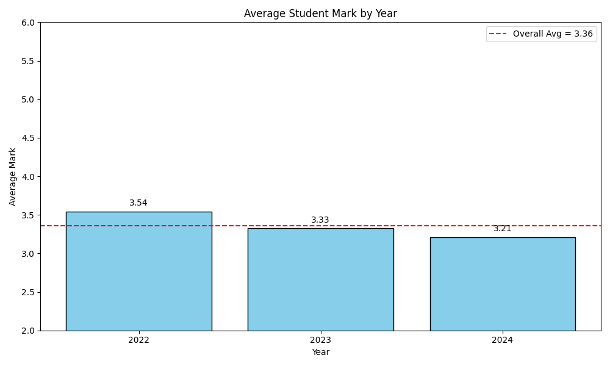
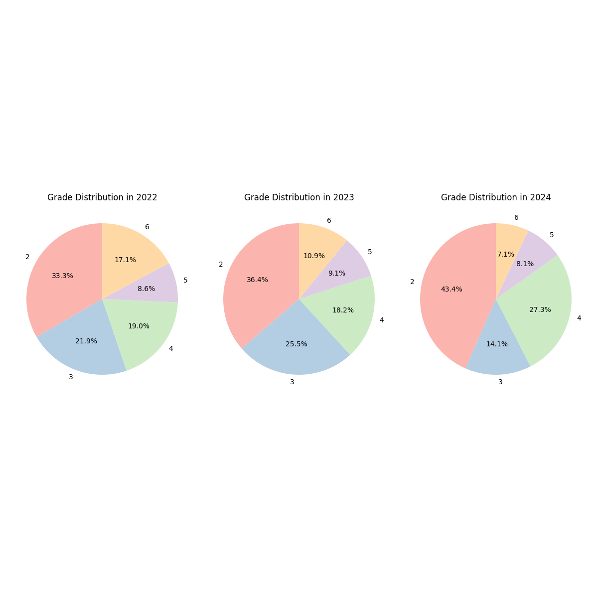

<h1 style="text-align: center;">Data Pipeline Development for Effective Data Management and Processing</h1>
<h3 style="text-align: center;">Radoslav Ivanov, 9MI3400620</h3>

## 1. Overview

The **Student Scores Pipeline** automates the process of ingesting, cleaning, transforming, aggregating, analyzing, and storing student grade data. It is built using **Python**, **Pandas**, **SQLite**, **Matplotlib**, and **Prefect** for orchestration.  

The pipeline detects new CSV files, processes them, stores the cleaned data in a database, performs exploratory data analysis (EDA), and generates plots for reporting.

---

## 2. Tools, Technologies, and Libraries

| Component        | Purpose                                                                 |
|-----------------|-------------------------------------------------------------------------|
| Python           | Primary programming language                                             |
| Pandas           | Data manipulation and cleaning                                           |
| Matplotlib       | Data visualization (bar charts, pie charts)                             |
| SQLite           | Lightweight relational database for storing processed data             |
| Prefect          | Orchestration and automation of tasks and flows                         |
| pathlib, os      | File system navigation and management                                    |
| logging          | Tracking pipeline execution, errors, and warnings                       |

---

## 3. Data
The data used in this pipeline is **real student exam data** collected from actual university courses. It contains **scores (points) earned on multiple assessments** throughout the semester, including:

- **Theoretical exams** – written tests that evaluate students’ understanding of the subject matter.  
- **Practical assessments** – problem-solving exercises where students apply concepts to solve specific problems.  

Each record corresponds to a student’s score in a specific assessment, and the dataset aggregates these scores to calculate overall grades.  

**Notes and Assumptions:**
- Data is anonymized to protect student privacy.  
- Grades are represented on a numeric scale (2–6), with 2 being the minimum passing mark.  
- The dataset covers multiple academic years and different student groups.

---

## 4. Pipeline Steps

### Step 1: Data Ingestion
- The pipeline searches a local folder (`data/`) for new CSV files that have not yet been added to the database.
- File naming convention: `DS_<year>.csv` (e.g., `DS_2022.csv`).
- New files are returned for further processing.

**Decisions/Assumptions:**  
- Only CSV files are supported.  
- File year is inferred from the filename.

---

### Step 2: Data Cleaning
- Removes empty columns and rows (`dropna`).  
- Converts grade values (`Оценка`) to numeric, filling invalid or missing entries with a default of `2.0`.  
- Drops duplicate rows.

**Decisions/Assumptions:**  
- Missing grades are imputed with `2.0`, assuming it represents the lowest valid score.  
- Empty columns are dropped because they contain no meaningful data.

---

### Step 3: Data Transformation
- Adds a `Година` column to record the year of the data.  
- Ensures consistent data types (`int` for `Година`, `float` for `Оценка`).  
- Removes rows where all columns (except key ones) are missing.

**Decisions/Assumptions:**  
- Only minimal transformations are applied.  
- Columns are assumed to have consistent names across files.

---

### Step 4: Data Aggregation
- Computes average grades per year.  
- Generates descriptive statistics per year and overall.

**Decisions/Assumptions:**  
- Aggregation is done at the **year level**, assuming this is the main reporting dimension.

---

### Step 5: Exploratory Data Analysis (EDA)
- **Bar charts**: Average grade per year with overall average reference.  
- **Pie charts**: Grade distribution per year.  
- Descriptive statistics printed to console.

**Decisions/Assumptions:**  
- Visualizations are saved in the `plots/` folder.  
- Grades are assumed to be integers in the range 2–6.

---

### Step 6: Data Storage
- Processed data is appended to a **SQLite database** (`student_scores.db`).  
- Table name: `scores`.  

**Decisions/Assumptions:**  
- SQLite is chosen for simplicity and local storage.  
- `if_exists="append"` ensures new data is added without overwriting.

---

### Step 7: Pipeline Automation
- Prefect orchestrates tasks and flows.  
- Tasks include `find_new_files`, `process_csv`, `save_to_db`, `load_all_data`, and `analyze_and_plot`.  
- Flow is scheduled to run every day (`cron="0 0 * * *"`).  
- Retry logic is implemented for reading CSVs.

**Decisions/Assumptions:**  
- Small-scale pipeline suitable for local or lightweight environments.  
- Error handling and logging are included to track issues.

---

## 5. Assumptions and Limitations
- Files must follow the naming convention `DS_<year>.csv`.  
- Only numerical grades are supported; other formats are coerced or defaulted.  
- Currently handles only local CSV files.  
- No advanced feature engineering is performed (could be added later).  
- EDA focuses on descriptive statistics and simple visualizations.

---

## 6. Folder Structure
```
project/
│
├─ data/ # CSV files for ingestion
├─ plots/ # Generated visualizations
├─ student_scores.db # SQLite database
└─ student_pipeline.py # Main Prefect pipeline script
```
---

## 7. How to Run
- Install dependencies:  
```bash
pip install -r requirements.txt 
```
### 7.1. Run the pipeline manually
```
python pipeline.py
```
### 7.2. Run the pipeline with scheduling
- Uncomment
```
student_scores_pipeline.serve(name="student_grades", cron="0 0 * * *")
```
- Comment
```
student_scores_pipeline()
```
- Start the Prefect Server
```
prefect server start
```
- Run the script
```
python pipeline.py
```
- Executions can be tracked on http://localhost:4200/dashboard

## 8. Results
- Average Student Mark by Year



- Grade Distribution by Year

